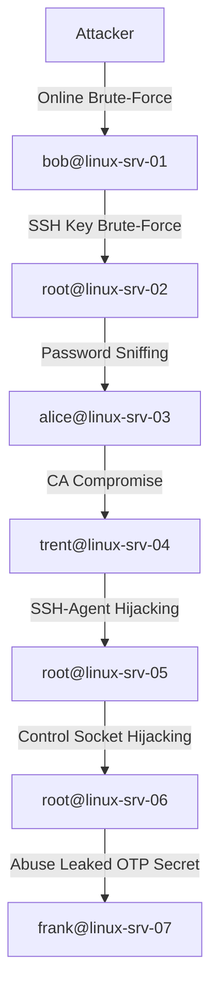

# Walk-Through

Here in this walk-through, you can find the solutions of the labs.

The attack path looks like this:

```mermaid
flowchart TD
    A[Attacker]
    -- Online Brute-Force --> B["bob@linux-srv-01"]
    -- SSH Key Brute-Force --> C["root@linux-srv-02"]
    -- Password Sniffing --> D["alice@linux-srv-03"]
    -- CA Compromise --> E["trent@linux-srv-04"]
    -- SSH-Agent Hijacking --> F["root@linux-srv-05"]
    -- Control Socket Hijacking --> G["root@linux-srv-06"]
    -- Abuse Leaked OTP Secret --> H["frank@linux-srv-07"]
```